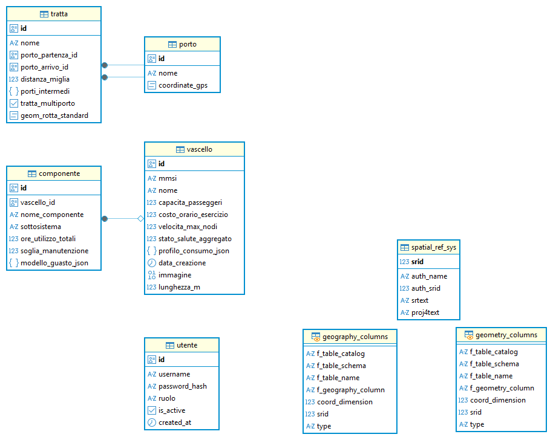
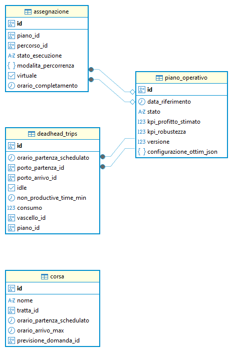
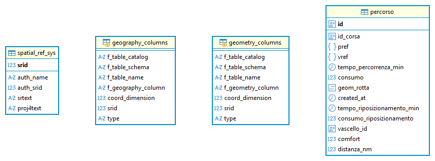
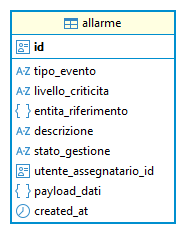
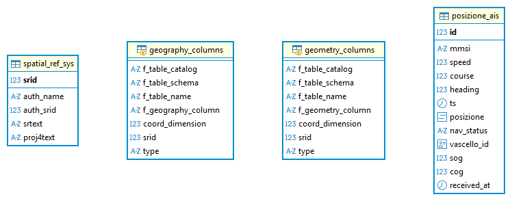

# Architettura attuale SMART-DSS-MICROSERVICES

## Stato runtime verificato (strict no-fallback)
- Gateway con fallback disattivato: `ENABLE_*_FALLBACK=false`.
- Per i servizi split (`anagrafica`, `operativo`, `percorsi`, `forecast`, `alerting`) il `DB_CONN` è volutamente invalido in test strict; il servizio usa il rispettivo `*_DB_CONN` dedicato.
- Anche `telemetry` usa connessione dedicata (`TELEMETRY_DB_CONN`) verso `telemetry_db`.
- Questo documento mappa endpoint -> servizio proprietario -> database primario usato nell'assetto attuale.

## Mappa database per dominio
| Dominio/Servizio | Database primario | Note |
|---|---|---|
| anagrafica | `anagrafica_db` | `travelmar_db` solo fallback legacy (disattivato in strict mode) |
| operativo | `operativo_db` | `travelmar_db` solo fallback legacy (disattivato in strict mode) |
| percorsi | `percorsi_db` | `travelmar_db` solo fallback legacy (disattivato in strict mode) |
| forecast | `forecast_db` | `travelmar_db` solo fallback legacy (disattivato in strict mode) |
| alerting | `alerting_db` | `travelmar_db` solo fallback legacy (disattivato in strict mode) |
| telemetry | `telemetry_db` | connessione dedicata via `TELEMETRY_DB_CONN` |
| scheduler/simulator/replanning/config | N/A | servizi esterni/configurazione, non DB-centric gateway |

## Mappatura servizio <=> database (consumo runtime)
| Servizio | Database consumato | Modalità di interfacciamento | Note |
|---|---|---|---|
| backend (gateway) | N/A primario; fallback legacy su `travelmar_db` solo se abilitato | delega HTTP verso microservizi + fallback condizionale | In strict mode i fallback sono disattivati (`ENABLE_*_FALLBACK=false`) |
| anagrafica_service | `anagrafica_db` | connessione diretta PostgreSQL (`ANAGRAFICA_DB_CONN`) | dominio anagrafica (porti, tratte, vascelli) |
| operativo_service | `operativo_db` | connessione diretta PostgreSQL (`OPERATIVO_DB_CONN`) | dominio operativo (piani, corse, assegnazioni, deadhead) |
| percorsi_service | `percorsi_db` | connessione diretta PostgreSQL (`PERCORSI_DB_CONN`) | dominio percorsi |
| forecast_service | `forecast_db` | connessione diretta PostgreSQL (`FORECAST_DB_CONN`) | dominio previsioni |
| alerting_service | `alerting_db` | connessione diretta PostgreSQL (`ALERTING_DB_CONN`) | dominio allarmi |
| telemetry_service | `telemetry_db` | connessione diretta PostgreSQL (`TELEMETRY_DB_CONN`) | dominio telemetria |
| scheduler_service | N/A | servizio applicativo (non DB-centric nel gateway) | orchestrazione/scheduling |
| simulator_service | N/A | servizio applicativo (non DB-centric nel gateway) | simulazioni |
| SMART_replanning_service | N/A | event-driven/Kafka | replanning |

## Diagrammi ER dei database

### Anagrafica DB

### Operativo DB

### Percorsi DB

### Forecast DB

### Alerting DB

### Telemetry DB

## Endpoint pubblici del Gateway (`backend` su :15080)
| Metodo | Endpoint | Servizio proprietario | DB usato | Sorgente |
|---|---|---|---|---|
| GET | `/allarme/lista` | gateway -> alerting | alerting_db (strict mode), travelmar_db solo fallback legacy | `app/routers/allarme.py` |
| GET | `/api/config/kafka-settings` | gateway -> backend-config | N/A (config runtime) | `app/routers/config.py` |
| POST | `/api/config/kafka-settings` | gateway -> backend-config | N/A (config runtime) | `app/routers/config.py` |
| POST | `/assegnazione/bulk` | gateway -> operativo | operativo_db (strict mode), travelmar_db solo fallback legacy | `app/routers/assegnazione.py` |
| GET | `/assegnazione/{assegnazione_id}` | gateway -> operativo | operativo_db (strict mode), travelmar_db solo fallback legacy | `app/routers/assegnazione.py` |
| GET | `/assegnazione/by_piano/{piano_id}` | gateway -> operativo | operativo_db (strict mode), travelmar_db solo fallback legacy | `app/routers/assegnazione.py` |
| POST | `/assegnazione/check_validita` | gateway -> operativo | operativo_db (strict mode), travelmar_db solo fallback legacy | `app/routers/assegnazione.py` |
| POST | `/assegnazione/crea` | gateway -> operativo | operativo_db (strict mode), travelmar_db solo fallback legacy | `app/routers/assegnazione.py` |
| POST | `/assegnazione/in_corso2cancellata` | gateway -> operativo | operativo_db (strict mode), travelmar_db solo fallback legacy | `app/routers/assegnazione.py` |
| PATCH | `/assegnazione/{assegnazione_id}/stato` | gateway -> operativo | operativo_db (strict mode), travelmar_db solo fallback legacy | `app/routers/assegnazione.py` |
| POST | `/assegnazione/pianifica` | gateway -> scheduler | N/A (servizio scheduling; persistenza non su DB gateway) | `app/routers/pianificazione.py` |
| POST | `/check_replanning` | gateway -> replanning | N/A (event-driven/Kafka) | `app/routers/replanning.py` |
| GET | `/check_replanning/status` | gateway -> replanning | N/A (event-driven/Kafka) | `app/routers/replanning.py` |
| GET | `/config` | gateway -> backend-config | N/A (config runtime) | `app/routers/config.py` |
| POST | `/config` | gateway -> backend-config | N/A (config runtime) | `app/routers/config.py` |
| GET | `/corsa/{corsa_id}` | gateway -> operativo | operativo_db (strict mode), travelmar_db solo fallback legacy | `app/routers/corsa.py` |
| POST | `/corsa/{corsa_id}/prevedi` | gateway -> operativo | operativo_db (strict mode), travelmar_db solo fallback legacy | `app/routers/corsa.py` |
| POST | `/corsa/crea` | gateway -> operativo | operativo_db (strict mode), travelmar_db solo fallback legacy | `app/routers/corsa.py` |
| POST | `/corsa/elimina` | gateway -> operativo | operativo_db (strict mode), travelmar_db solo fallback legacy | `app/routers/corsa.py` |
| GET | `/corsa/giorno` | gateway -> operativo | operativo_db (strict mode), travelmar_db solo fallback legacy | `app/routers/corsa.py` |
| GET | `/corsa/lista` | gateway -> operativo | operativo_db (strict mode), travelmar_db solo fallback legacy | `app/routers/corsa.py` |
| POST | `/corsa/modifica` | gateway -> operativo | operativo_db (strict mode), travelmar_db solo fallback legacy | `app/routers/corsa.py` |
| GET | `/corsa/orari/{tratta_id}` | gateway -> operativo | operativo_db (strict mode), travelmar_db solo fallback legacy | `app/routers/corsa.py` |
| GET | `/dashboard/corse` | gateway -> operativo | operativo_db (strict mode), travelmar_db solo fallback legacy | `app/routers/corsa.py` |
| POST | `/deadhead/crea` | gateway -> operativo | operativo_db (strict mode), travelmar_db solo fallback legacy | `app/routers/deadhead.py` |
| POST | `/deadhead/elimina` | gateway -> operativo | operativo_db (strict mode), travelmar_db solo fallback legacy | `app/routers/deadhead.py` |
| GET | `/deadhead/lista` | gateway -> operativo | operativo_db (strict mode), travelmar_db solo fallback legacy | `app/routers/deadhead.py` |
| POST | `/deadhead/modifica` | gateway -> operativo | operativo_db (strict mode), travelmar_db solo fallback legacy | `app/routers/deadhead.py` |
| GET | `/percorso/{percorso_id}` | gateway -> percorsi | percorsi_db (strict mode), travelmar_db solo fallback legacy | `app/routers/percorso.py` |
| POST | `/percorso/applica_variazione` | gateway -> percorsi | percorsi_db (strict mode), travelmar_db solo fallback legacy | `app/routers/percorso.py` |
| GET | `/percorso/by_corsa/{corsa_id}` | gateway -> percorsi | percorsi_db (strict mode), travelmar_db solo fallback legacy | `app/routers/percorso.py` |
| POST | `/percorso/elimina` | gateway -> percorsi | percorsi_db (strict mode), travelmar_db solo fallback legacy | `app/routers/percorso.py` |
| POST | `/pianificazione/compatibili` | gateway -> scheduler | N/A (servizio scheduling; persistenza non su DB gateway) | `app/routers/pianificazione.py` |
| GET | `/piano/{piano_id}` | gateway -> operativo | operativo_db (strict mode), travelmar_db solo fallback legacy | `app/routers/piano_operativo.py` |
| POST | `/piano/crea` | gateway -> operativo | operativo_db (strict mode), travelmar_db solo fallback legacy | `app/routers/piano_operativo.py` |
| POST | `/piano/elimina` | gateway -> operativo | operativo_db (strict mode), travelmar_db solo fallback legacy | `app/routers/piano_operativo.py` |
| GET | `/piano/lista` | gateway -> operativo | operativo_db (strict mode), travelmar_db solo fallback legacy | `app/routers/piano_operativo.py` |
| POST | `/piano/modifica` | gateway -> operativo | operativo_db (strict mode), travelmar_db solo fallback legacy | `app/routers/piano_operativo.py` |
| POST | `/piano/valida` | gateway -> operativo | operativo_db (strict mode), travelmar_db solo fallback legacy | `app/routers/piano_operativo.py` |
| GET | `/porto/{porto_id}` | gateway -> anagrafica | anagrafica_db (strict mode), travelmar_db solo fallback legacy | `app/routers/porto.py` |
| GET | `/porto/by_name/{nome}` | gateway -> anagrafica | anagrafica_db (strict mode), travelmar_db solo fallback legacy | `app/routers/porto.py` |
| POST | `/porto/crea` | gateway -> anagrafica | anagrafica_db (strict mode), travelmar_db solo fallback legacy | `app/routers/porto.py` |
| POST | `/porto/elimina` | gateway -> anagrafica | anagrafica_db (strict mode), travelmar_db solo fallback legacy | `app/routers/porto.py` |
| GET | `/porto/lista` | gateway -> anagrafica | anagrafica_db (strict mode), travelmar_db solo fallback legacy | `app/routers/porto.py` |
| POST | `/porto/modifica` | gateway -> anagrafica | anagrafica_db (strict mode), travelmar_db solo fallback legacy | `app/routers/porto.py` |
| POST | `/scheduling/giorno` | gateway -> scheduler | N/A (servizio scheduling; persistenza non su DB gateway) | `app/routers/pianificazione.py` |
| POST | `/scheduling/ottimizza` | gateway -> scheduler | N/A (servizio scheduling; persistenza non su DB gateway) | `app/routers/pianificazione.py` |
| POST | `/simulation/build_and_run` | gateway -> simulator | N/A (servizio simulazione) | `app/routers/simulazione.py` |
| GET | `/simulation/schedulate` | gateway -> simulator | N/A (servizio simulazione) | `app/routers/simulazione.py` |
| POST | `/simulation/simula_piano` | gateway -> simulator | N/A (servizio simulazione) | `app/routers/simulazione.py` |
| GET | `/tratta/{tratta_id}` | gateway -> anagrafica | anagrafica_db (strict mode), travelmar_db solo fallback legacy | `app/routers/tratta.py` |
| POST | `/tratta/crea` | gateway -> anagrafica | anagrafica_db (strict mode), travelmar_db solo fallback legacy | `app/routers/tratta.py` |
| POST | `/tratta/crea_multi` | gateway -> anagrafica | anagrafica_db (strict mode), travelmar_db solo fallback legacy | `app/routers/tratta.py` |
| POST | `/tratta/elimina` | gateway -> anagrafica | anagrafica_db (strict mode), travelmar_db solo fallback legacy | `app/routers/tratta.py` |
| GET | `/tratta/lista` | gateway -> anagrafica | anagrafica_db (strict mode), travelmar_db solo fallback legacy | `app/routers/tratta.py` |
| POST | `/tratta/modifica` | gateway -> anagrafica | anagrafica_db (strict mode), travelmar_db solo fallback legacy | `app/routers/tratta.py` |
| GET | `/vascello/{mmsi}/image` | gateway -> anagrafica | anagrafica_db (strict mode), travelmar_db solo fallback legacy | `app/routers/vascello.py` |
| GET | `/vascello/{mmsi}/percorso_attivo` | gateway -> anagrafica | anagrafica_db (strict mode), travelmar_db solo fallback legacy | `app/routers/vascello.py` |
| GET | `/vascello/{vascello_id}` | gateway -> anagrafica | anagrafica_db (strict mode), travelmar_db solo fallback legacy | `app/routers/vascello.py` |
| GET | `/vascello/by_mmsi/{mmsi}` | gateway -> anagrafica | anagrafica_db (strict mode), travelmar_db solo fallback legacy | `app/routers/vascello.py` |
| POST | `/vascello/crea` | gateway -> anagrafica | anagrafica_db (strict mode), travelmar_db solo fallback legacy | `app/routers/vascello.py` |
| POST | `/vascello/elimina` | gateway -> anagrafica | anagrafica_db (strict mode), travelmar_db solo fallback legacy | `app/routers/vascello.py` |
| GET | `/vascello/lista` | gateway -> anagrafica | anagrafica_db (strict mode), travelmar_db solo fallback legacy | `app/routers/vascello.py` |
| POST | `/vascello/modifica` | gateway -> anagrafica | anagrafica_db (strict mode), travelmar_db solo fallback legacy | `app/routers/vascello.py` |
| POST | `/weather_routing/carico` | gateway -> scheduler | N/A (servizio scheduling; persistenza non su DB gateway) | `app/routers/pianificazione.py` |
| POST | `/weather_routing/vuoto` | gateway -> scheduler | N/A (servizio scheduling; persistenza non su DB gateway) | `app/routers/pianificazione.py` |

## Endpoint interni dei microservizi
| Metodo | Endpoint | Servizio | DB usato | Sorgente |
|---|---|---|---|---|
| GET | `/health` | alerting service | alerting_db (strict mode), travelmar_db solo fallback legacy | `alerting_service/main.py` |
| GET | `/internal/allarme/lista` | alerting service | alerting_db (strict mode), travelmar_db solo fallback legacy | `alerting_service/main.py` |
| GET | `/health` | anagrafica service | anagrafica_db (strict mode), travelmar_db solo fallback legacy | `anagrafica_service/main.py` |
| GET | `/internal/porto/{porto_id}` | anagrafica service | anagrafica_db (strict mode), travelmar_db solo fallback legacy | `anagrafica_service/main.py` |
| GET | `/internal/porto/by_name/{nome}` | anagrafica service | anagrafica_db (strict mode), travelmar_db solo fallback legacy | `anagrafica_service/main.py` |
| POST | `/internal/porto/crea` | anagrafica service | anagrafica_db (strict mode), travelmar_db solo fallback legacy | `anagrafica_service/main.py` |
| POST | `/internal/porto/elimina` | anagrafica service | anagrafica_db (strict mode), travelmar_db solo fallback legacy | `anagrafica_service/main.py` |
| GET | `/internal/porto/lista` | anagrafica service | anagrafica_db (strict mode), travelmar_db solo fallback legacy | `anagrafica_service/main.py` |
| POST | `/internal/porto/modifica` | anagrafica service | anagrafica_db (strict mode), travelmar_db solo fallback legacy | `anagrafica_service/main.py` |
| GET | `/internal/tratta/{tratta_id}` | anagrafica service | anagrafica_db (strict mode), travelmar_db solo fallback legacy | `anagrafica_service/main.py` |
| POST | `/internal/tratta/crea` | anagrafica service | anagrafica_db (strict mode), travelmar_db solo fallback legacy | `anagrafica_service/main.py` |
| POST | `/internal/tratta/crea_multi` | anagrafica service | anagrafica_db (strict mode), travelmar_db solo fallback legacy | `anagrafica_service/main.py` |
| POST | `/internal/tratta/elimina` | anagrafica service | anagrafica_db (strict mode), travelmar_db solo fallback legacy | `anagrafica_service/main.py` |
| GET | `/internal/tratta/lista` | anagrafica service | anagrafica_db (strict mode), travelmar_db solo fallback legacy | `anagrafica_service/main.py` |
| POST | `/internal/tratta/modifica` | anagrafica service | anagrafica_db (strict mode), travelmar_db solo fallback legacy | `anagrafica_service/main.py` |
| GET | `/internal/vascello/{mmsi}/image` | anagrafica service | anagrafica_db (strict mode), travelmar_db solo fallback legacy | `anagrafica_service/main.py` |
| GET | `/internal/vascello/{vascello_id}` | anagrafica service | anagrafica_db (strict mode), travelmar_db solo fallback legacy | `anagrafica_service/main.py` |
| GET | `/internal/vascello/by_mmsi/{mmsi}` | anagrafica service | anagrafica_db (strict mode), travelmar_db solo fallback legacy | `anagrafica_service/main.py` |
| POST | `/internal/vascello/crea` | anagrafica service | anagrafica_db (strict mode), travelmar_db solo fallback legacy | `anagrafica_service/main.py` |
| POST | `/internal/vascello/elimina` | anagrafica service | anagrafica_db (strict mode), travelmar_db solo fallback legacy | `anagrafica_service/main.py` |
| GET | `/internal/vascello/lista` | anagrafica service | anagrafica_db (strict mode), travelmar_db solo fallback legacy | `anagrafica_service/main.py` |
| POST | `/internal/vascello/modifica` | anagrafica service | anagrafica_db (strict mode), travelmar_db solo fallback legacy | `anagrafica_service/main.py` |
| GET | `/health` | forecast service | forecast_db (strict mode), travelmar_db solo fallback legacy | `forecast_service/main.py` |
| GET | `/internal/previsione/{previsione_id}` | forecast service | forecast_db (strict mode), travelmar_db solo fallback legacy | `forecast_service/main.py` |
| POST | `/internal/previsione/corsa/{corsa_id}/calcola` | forecast service | forecast_db (strict mode), travelmar_db solo fallback legacy | `forecast_service/main.py` |
| GET | `/health` | operativo service | operativo_db (strict mode), travelmar_db solo fallback legacy | `operativo_service/main.py` |
| GET | `/internal/assegnazione/{assegnazione_id}` | operativo service | operativo_db (strict mode), travelmar_db solo fallback legacy | `operativo_service/main.py` |
| POST | `/internal/assegnazione/bulk` | operativo service | operativo_db (strict mode), travelmar_db solo fallback legacy | `operativo_service/main.py` |
| GET | `/internal/assegnazione/by_piano/{piano_id}` | operativo service | operativo_db (strict mode), travelmar_db solo fallback legacy | `operativo_service/main.py` |
| POST | `/internal/assegnazione/crea` | operativo service | operativo_db (strict mode), travelmar_db solo fallback legacy | `operativo_service/main.py` |
| POST | `/internal/assegnazione/in_corso2cancellata` | operativo service | operativo_db (strict mode), travelmar_db solo fallback legacy | `operativo_service/main.py` |
| PATCH | `/internal/assegnazione/{assegnazione_id}/stato` | operativo service | operativo_db (strict mode), travelmar_db solo fallback legacy | `operativo_service/main.py` |
| POST | `/internal/corsa/crea` | operativo service | operativo_db (strict mode), travelmar_db solo fallback legacy | `operativo_service/main.py` |
| POST | `/internal/corsa/elimina` | operativo service | operativo_db (strict mode), travelmar_db solo fallback legacy | `operativo_service/main.py` |
| GET | `/internal/corsa/giorno` | operativo service | operativo_db (strict mode), travelmar_db solo fallback legacy | `operativo_service/main.py` |
| GET | `/internal/corsa/id/{corsa_id}` | operativo service | operativo_db (strict mode), travelmar_db solo fallback legacy | `operativo_service/main.py` |
| GET | `/internal/corsa/lista` | operativo service | operativo_db (strict mode), travelmar_db solo fallback legacy | `operativo_service/main.py` |
| GET | `/internal/corsa/orari/{tratta_id}` | operativo service | operativo_db (strict mode), travelmar_db solo fallback legacy | `operativo_service/main.py` |
| POST | `/internal/corsa/modifica` | operativo service | operativo_db (strict mode), travelmar_db solo fallback legacy | `operativo_service/main.py` |
| POST | `/internal/deadhead/crea` | operativo service | operativo_db (strict mode), travelmar_db solo fallback legacy | `operativo_service/main.py` |
| POST | `/internal/deadhead/elimina` | operativo service | operativo_db (strict mode), travelmar_db solo fallback legacy | `operativo_service/main.py` |
| GET | `/internal/deadhead/lista` | operativo service | operativo_db (strict mode), travelmar_db solo fallback legacy | `operativo_service/main.py` |
| POST | `/internal/deadhead/modifica` | operativo service | operativo_db (strict mode), travelmar_db solo fallback legacy | `operativo_service/main.py` |
| GET | `/internal/piano/{piano_id}` | operativo service | operativo_db (strict mode), travelmar_db solo fallback legacy | `operativo_service/main.py` |
| POST | `/internal/piano/crea` | operativo service | operativo_db (strict mode), travelmar_db solo fallback legacy | `operativo_service/main.py` |
| POST | `/internal/piano/elimina` | operativo service | operativo_db (strict mode), travelmar_db solo fallback legacy | `operativo_service/main.py` |
| GET | `/internal/piano/lista` | operativo service | operativo_db (strict mode), travelmar_db solo fallback legacy | `operativo_service/main.py` |
| POST | `/internal/piano/modifica` | operativo service | operativo_db (strict mode), travelmar_db solo fallback legacy | `operativo_service/main.py` |
| GET | `/health` | percorsi service | percorsi_db (strict mode), travelmar_db solo fallback legacy | `percorsi_service/main.py` |
| GET | `/internal/percorso/{percorso_id}` | percorsi service | percorsi_db (strict mode), travelmar_db solo fallback legacy | `percorsi_service/main.py` |
| POST | `/internal/percorso/applica_variazione` | percorsi service | percorsi_db (strict mode), travelmar_db solo fallback legacy | `percorsi_service/main.py` |
| GET | `/internal/percorso/by_corsa/{corsa_id}` | percorsi service | percorsi_db (strict mode), travelmar_db solo fallback legacy | `percorsi_service/main.py` |
| POST | `/internal/percorso/crea_batch` | percorsi service | percorsi_db (strict mode), travelmar_db solo fallback legacy | `percorsi_service/main.py` |
| POST | `/internal/percorso/elimina` | percorsi service | percorsi_db (strict mode), travelmar_db solo fallback legacy | `percorsi_service/main.py` |
| GET | `/health` | telemetry service | telemetry_db (via `TELEMETRY_DB_CONN`) | `telemetry_service/main.py` |
| GET | `/internal/telemetry/positions/recent` | telemetry service | telemetry_db (via `TELEMETRY_DB_CONN`) | `telemetry_service/main.py` |

## Nota operativa
- La tabella indica il **database primario attuale**. In strict mode i fallback legacy verso `travelmar_db` per i domini split sono bloccati/configurati per fallire.
